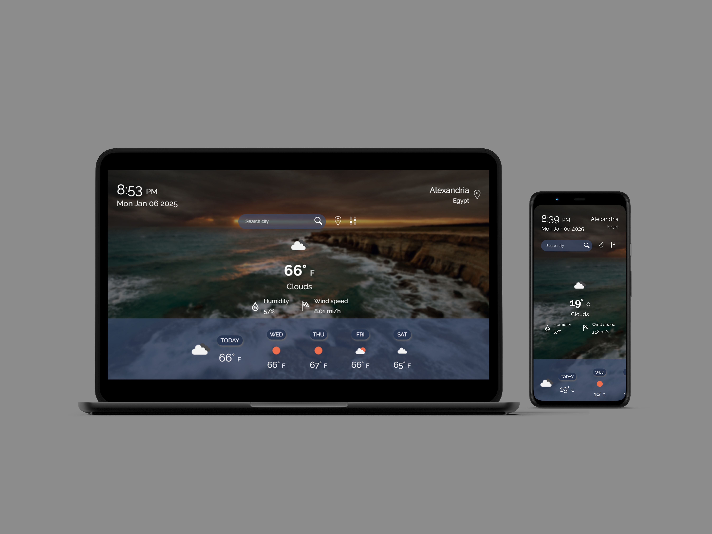

# Weather-Journal App Project

## Table of Contents

-   [Overview](#Instructions)
-   [Description](#Description)
-   [KeyFeatures](#key-features)
-   [TechnicalStack](#technical-stack)

**Live demo** [click here](https://weather-journal-web.netlify.app/)

### **Weather Journal App**

### **Overview:**

This asynchronous web app uses Web API and user data to dynamically update the UI.

---

### **Description:**

The Weather Journal App is a lightweight, interactive web application designed to display current weather conditions and forecast for next days in a simple user interface. It leverages serverless functions for seamless data processing, removing the need for a traditional backend. Users can input any city name or use their current location to fetch weather data and toggle between imperial and metric units for convenience.

---

### **Key Features:**

1. **User Input:**

    - Users can search for weather conditions by entering a city name.
    - Alternatively, users can opt to fetch weather based on their current geolocation.

2. **Weather Fetching:**

    - Retrieves the current weather conditions for the provided location using an external API (OpenWeatherMap).

3. **Unit Preference:**

    - Provides the option to toggle between imperial (°F, miles) and metric (°C, kilometers) measurement units, accommodating user preferences.

4. **Data Display:**

    - Displays current weather details, including temperature, description, and other relevant conditions, in a simple, user-friendly format.

5. **Serverless Architecure:**
    - Utilizes serverless functions for API requests and processing, ensuring fast and efficient operation without the need for a dedicated backend.

---

### **Technical Stack:**

-   **Frontend:** HTML, CSS, and JavaScript for the user interface and client-side functionality.
-   **Serverless Functions:** Handles API calls and data processing in a scalable and cost-effective manner.
-   **API Integration:** Uses an external weather API to fetch real-time data.

---

This project highlights the use of modern serverless architecture, geolocation services, and user-focused features, providing a streamlined experience for real-time weather updates.
